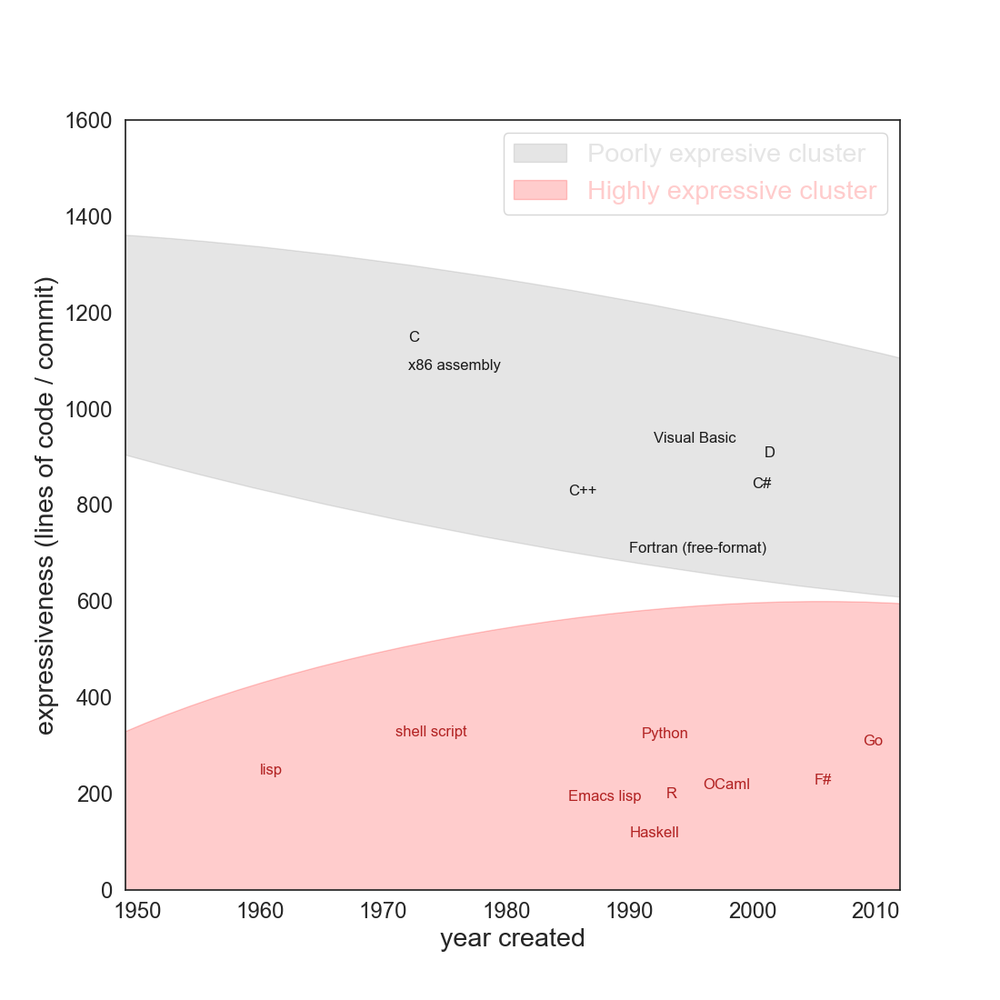

# Investigating the programming abilities of ChatGPT with an abitrary DSL

intro intro intro

> figure caption

## Domain-specific languages and ChatGPT

jshgkjhadjkhda

## Prompt-engineering

below is a collection of xyz

Finding similar companies

 

- Many ways of doing this; for first product itertion, can use simply similarity metric for company information
  
- Collaborative filtering is a good first-pass for this, and an influential recent [paper](https://arxiv.org/abs/1802.05814) shows that VAEs (which I use in my modelling) outperform classic approaches at collaborative filtering (see notebook)

- Ultimately, could leverage word embeddings/ word-to-vec models, such as those used in my [research](https://snap.stanford.edu/node2vec/)
  

Finding similar companies

 

- Many ways of doing this; for first product itertion, can use simply similarity metric for company information
  
- Collaborative filtering is a good first-pass for this, and an influential recent [paper](https://arxiv.org/abs/1802.05814) shows that VAEs (which I use in my modelling) outperform classic approaches at collaborative filtering (see notebook)

- Ultimately, could leverage word embeddings/ word-to-vec models, such as those used in my [research](https://snap.stanford.edu/node2vec/)
  

Finding similar companies

 

- Many ways of doing this; for first product itertion, can use simply similarity metric for company information
  
- Collaborative filtering is a good first-pass for this, and an influential recent [paper](https://arxiv.org/abs/1802.05814) shows that VAEs (which I use in my modelling) outperform classic approaches at collaborative filtering (see notebook)

- Ultimately, could leverage word embeddings/ word-to-vec models, such as those used in my [research](https://snap.stanford.edu/node2vec/)
  

